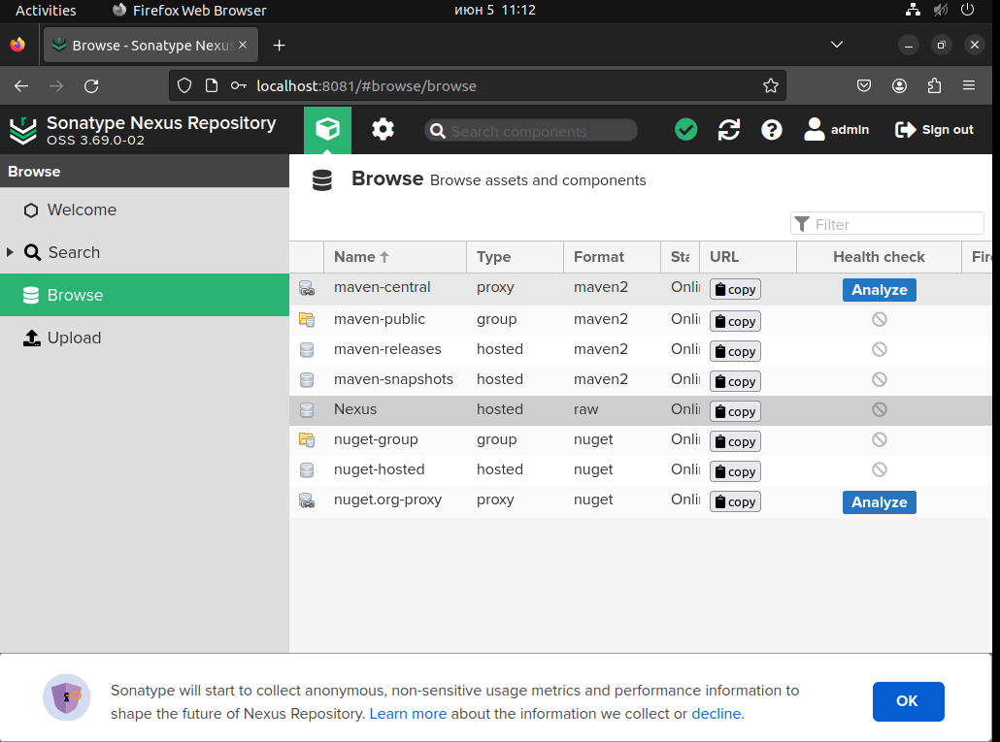

# Домашнее задание к занятию "`Что такое DevOps. СI/СD`" - `Красноюрченко Артем`


### Инструкция по выполнению домашнего задания

   1. Сделайте `fork` данного репозитория к себе в Github и переименуйте его по названию или номеру занятия, например, https://github.com/имя-вашего-репозитория/git-hw или  https://github.com/имя-вашего-репозитория/7-1-ansible-hw).
   2. Выполните клонирование данного репозитория к себе на ПК с помощью команды `git clone`.
   3. Выполните домашнее задание и заполните у себя локально этот файл README.md:
      - впишите вверху название занятия и вашу фамилию и имя
      - в каждом задании добавьте решение в требуемом виде (текст/код/скриншоты/ссылка)
      - для корректного добавления скриншотов воспользуйтесь [инструкцией "Как вставить скриншот в шаблон с решением](https://github.com/netology-code/sys-pattern-homework/blob/main/screen-instruction.md)
      - при оформлении используйте возможности языка разметки md (коротко об этом можно посмотреть в [инструкции  по MarkDown](https://github.com/netology-code/sys-pattern-homework/blob/main/md-instruction.md))
   4. После завершения работы над домашним заданием сделайте коммит (`git commit -m "comment"`) и отправьте его на Github (`git push origin`);
   5. Для проверки домашнего задания преподавателем в личном кабинете прикрепите и отправьте ссылку на решение в виде md-файла в вашем Github.
   6. Любые вопросы по выполнению заданий спрашивайте в чате учебной группы и/или в разделе “Вопросы по заданию” в личном кабинете.
   
Желаем успехов в выполнении домашнего задания!
   
### Дополнительные материалы, которые могут быть полезны для выполнения задания

1. [Руководство по оформлению Markdown файлов](https://gist.github.com/Jekins/2bf2d0638163f1294637#Code)

---

### Задание 1

`Установите себе jenkins по инструкции из лекции или любым другим способом из официальной документации. Использовать Docker в этом задании нежелательно.
Установите на машину с jenkins golang.
Используя свой аккаунт на GitHub, сделайте себе форк репозитория. В этом же репозитории находится дополнительный материал для выполнения ДЗ.
Создайте в jenkins Freestyle Project, подключите получившийся репозиторий к нему и произведите запуск тестов и сборку проекта go test . и docker build ..`

```
sudo apt update
sudo apt install fontconfig openjdk-17-jre
/usr/share/keyrings/jenkins-keyring.asc > /dev/null
echo deb [signed-by=/usr/share/keyrings/jenkins-keyring.asc] \
https://pkg.jenkins.io/debian-stable binary/ | sudo tee \
/etc/apt/sources.list.d/jenkins.list > /dev/null
sudo apt-get update
sudo apt-get install jenkins

```


---

### Задание 2

`Создайте новый проект pipeline.
Перепишите сборку из задания 1 на declarative в виде кода.`

```
pipeline {
    agent any
    stages {
        stage('Git') {
            steps {
                git url: 'https://github.com/rudebway/sdvps-materials-hw.git', branch: 'main'
            }
        }
        stage('Test') {
            steps {
                sh '/usr/bin/go test .'
            }
        }
        stage('Build') {
            steps {
                sh 'docker build . -t ubuntu-bionic:8081/hello-world:v$BUILD_NUMBER'
            }
        }
    }
}
```


---

### Задание 3

`Установите на машину Nexus.
Создайте raw-hosted репозиторий.
Измените pipeline так, чтобы вместо Docker-образа собирался бинарный go-файл. Команду можно скопировать из Dockerfile.
Загрузите файл в репозиторий с помощью jenkins.`


```
pipeline {
    agent any
    stages {
        stage('Git') {
            steps {
                git url: 'https://github.com/rudebway/sdvps-materials-hw.git', branch: 'main'
            }
        }
        stage('Test') {
            steps {
                sh '/usr/bin/go test .'
            }
        }
        stage ('Build') {
            steps {
                sh '/usr/bin/go build -a -installsuffix nocgo -o main .'
            }
        }
        stage ('Push') {
            steps {
                sh 'curl -u admin:admin --upload-file ./main http://192.168.122.45:8081/repository/Nexus/main'
            }        
        }
    }
}
```





